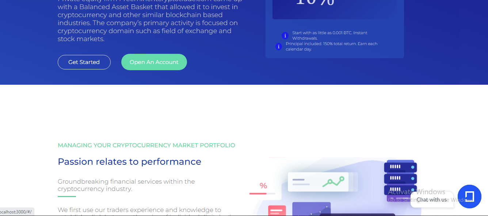

# ELITE-GAIN-FRONT-END

The front-end section of the **ELITE-GAIN** is built with React, Redux and styled-components.

## Built with

- JavaScript
- React
- Redux
- Axios
- styled-components

## API

## LIVE IMAGES



The API repository is not available for now due to security reasons

## Deployment

Check the live version of the application via this [link]()

## SetUp

To get a local copy up and running, follow these steps:

- You should have **_Node_** installed on your computer.
- Clone this repository into your computer by running the following command in your terminal:

```bash
> git clone https://github.com/ekenecf/TradePage.git
> cd hotel-reservation-frontend
```

- Run this command in the cloned directory, to install required packages:

```
npm install
```

- Run the project in your browser:

```
npm start
```

## Author

👤 **Nwachukwu Ekene**

- GitHub: [@ekenecf](https://github.com/ekenecf)
- LinkedIn: [Nwachukwu-Ekene](https://www.linkedin.com/in/nwachukwuekene/)
- Twitter: [Nwachukwu-Ekene](https://www.twitter.com/ekene070)
- Gmail: [ekens2u@gmail.com](mailto:ekens2u@gmail.com)

## 🤝 Contributing

Contributions, issues, and feature requests are welcome!

Feel free to check the [issues page](https://github.com/ekenecf/TradePage/issues).

## Show your support

Give a ⭐️ if you like this project!

## 📝 License

This project is [MIT](./MIT.md) licensed.
